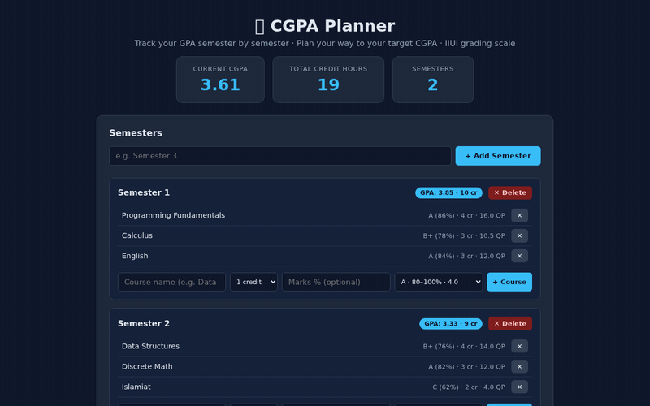

# 📊 CGPA Planner

**Stop guessing what your CGPA will be — know it, and plan it.**

A fast, private, zero-dependency web app for university students (built with a CS student, for CS students 🇵🇰). Enter your courses and grades each semester, watch your CGPA evolve on a live chart, and answer the eternal question: *"What GPA do I need from here to reach my target CGPA?"*

**🔗 Live demo:** https://muhammadmudasir-gif.github.io/cgpa-planner/


## ✨ Features

- 📝 **Semester & course tracking** — add courses with credit hours and grades (or just type your marks — the grade is picked for you), get instant GPA per semester
- 🇵🇰 **IIUI grading scale** — the official International Islamic University Islamabad scale: A (80%+) = 4.0 down to D (50%) = 1.0, no minus grades
- 📈 **Progress chart** — per-semester GPA bars + running CGPA line, drawn on raw canvas (no chart libraries!)
- 🎯 **Target simulator** — "I have a 2.8 with 3 semesters left. What do I need for a 3.4?" → instant answer, including *"that's mathematically impossible, even with straight A's"*
- 💾 **Private by design** — data lives in your browser's localStorage only. No accounts, no servers, nothing leaves your device
- ⬇ **Backup & restore** — export all your data as a JSON file, import it on another device
- ⚡ **Zero dependencies** — no frameworks, no build tools, no CDNs. Pure HTML/CSS/JS

## 🚀 How to run it

Open `index.html` in any browser. That's the whole install.

Or use the live version linked above.

## 🧮 How the math works

GPA = total quality points ÷ total credit hours, where a course's **quality points = credits × grade point**.

The simulator inverts that: given your current quality points and credit hours, the GPA `g` you need over `R` remaining credit hours to reach target `T` is:

```
g = (T × (credits + R) − qualityPoints) / R
```

If `g > 4.0`, the target is impossible — the app tells you instead of lying to you 🙂

All of this lives in `js/gpa.js` as **pure, unit-tested functions** — verified against hand-calculated values in `tests/gpa.test.js`.

## 📁 Project structure

```
cgpa-planner/
├── index.html          # The page
├── css/style.css       # Dark-mode UI
├── js/
│   ├── gpa.js          # Pure GPA math (browser + Node compatible)
│   └── app.js          # UI, localStorage, canvas chart
├── tests/gpa.test.js   # Dependency-free test suite
├── LICENSE             # MIT
└── README.md
```

## 🧪 Run the tests

```bash
node tests/gpa.test.js
```

## 🗺️ Roadmap

- [ ] Transcript-style printable summary view
- [ ] Dark/light theme toggle
- [ ] PWA support (install as an app on your phone)

## 🤝 Contributing

Issues and PRs welcome — check the roadmap above for ideas. The simulator math and chart are great places to start.

## 👤 Author

**Mudasir** — BS Computer Science student. Building in public.

GitHub: [muhammadmudasir-gif](https://github.com/muhammadmudasir-gif)

## 📄 License

MIT — see [LICENSE](LICENSE)
